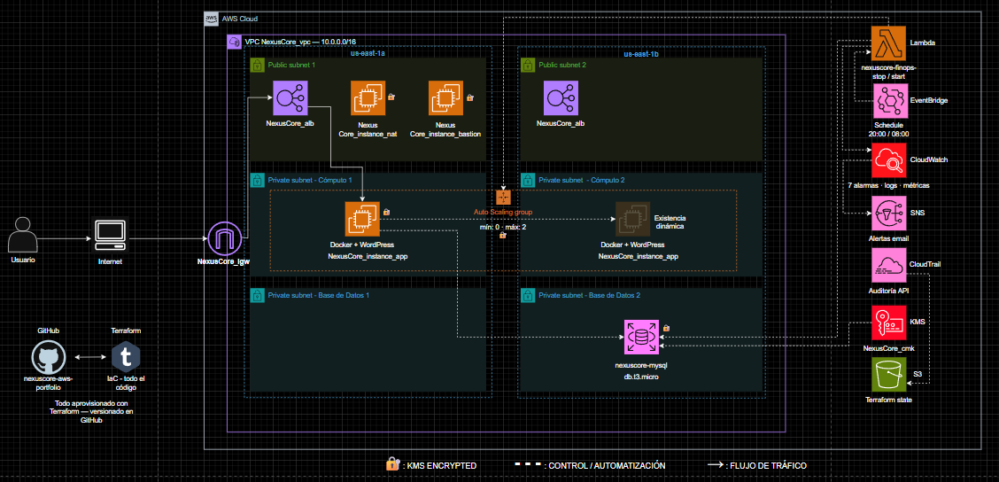
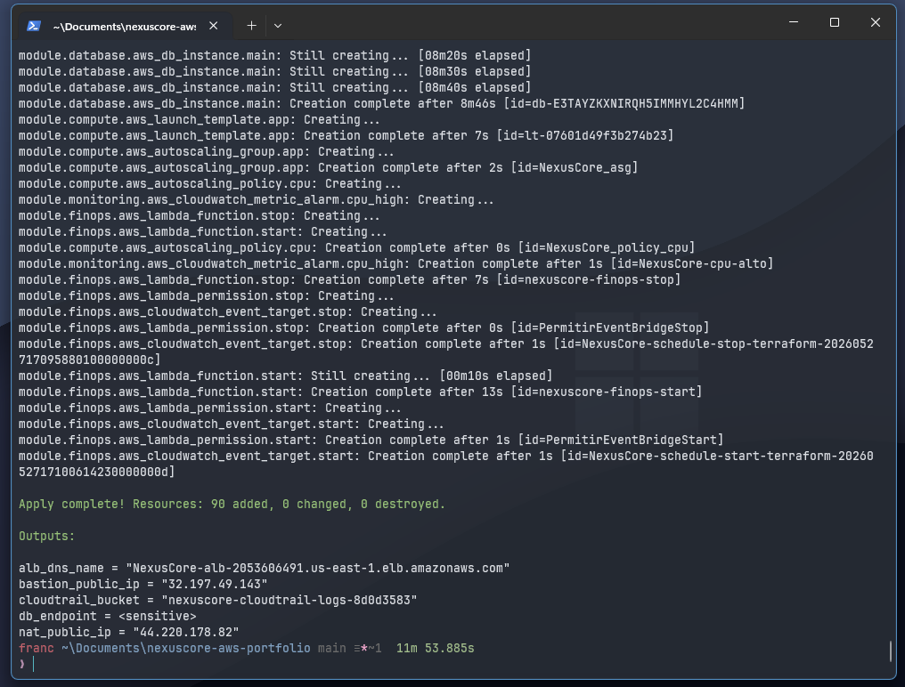
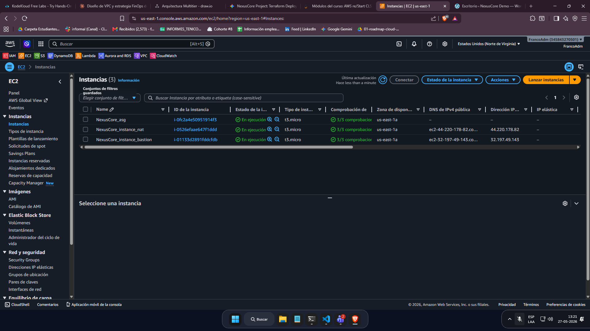
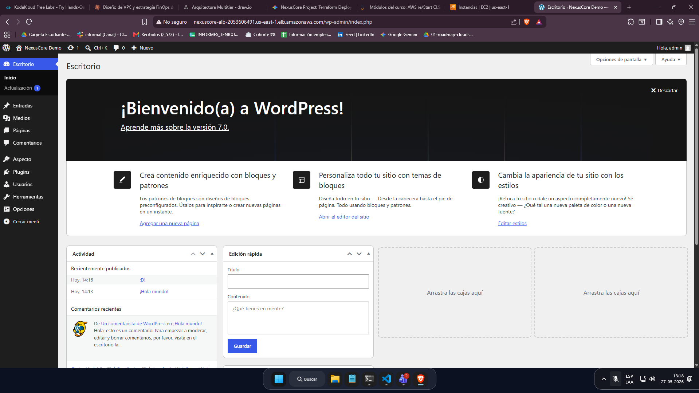
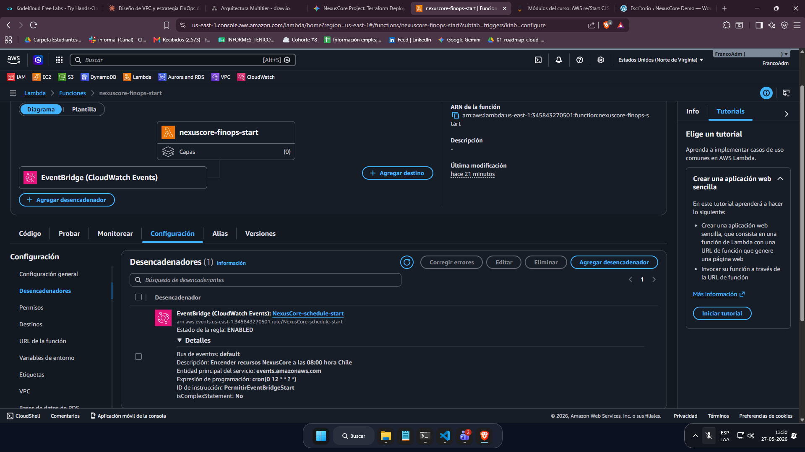
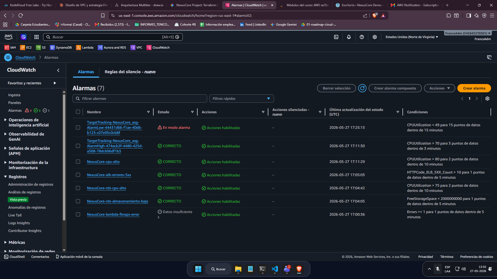

# NexusCore AWS Portfolio 🚀

¡Bienvenido a NexusCore! Este proyecto consiste en el despliegue automatizado de una arquitectura web altamente disponible y segura en Amazon Web Services (AWS), utilizando **Terraform** como herramienta de Infraestructura como Código (IaC) y **Docker** para la contenedorización de la aplicación.

---

## 🗺️ Diagrama de Arquitectura

A continuación se presenta el diseño visual de la infraestructura implementada en la nube:

---

## 🛠️ Tecnologías Utilizadas

* **Infraestructura como Código (IaC):** Terraform
* **Proveedor Cloud:** Amazon Web Services (AWS)
* **Contenedorización:** Docker
* **Sistema Operativo:** Linux (Ubuntu / Amazon Linux 2)

---

## 🏗️ Componentes Clave de la Arquitectura

Para lograr una infraestructura empresarial, segura y automatizada, se implementaron los siguientes módulos de AWS:

* **Redes y Seguridad:** Una VPC personalizada con 6 subredes (públicas y privadas) distribuidas en múltiples zonas de disponibilidad, protegidas por Security Groups de acceso mínimo.

* **Cómputo de Alta Disponibilidad:** Un grupo de Auto Scaling (ASG) respaldado por un Application Load Balancer (ALB) para distribuir el tráfico web de forma equitativa.

* **Base de Datos Blindada:** Amazon RDS MySQL alojado exclusivamente en subredes privadas, inaccesible desde el internet público.

* **Automatización y FinOps:** Funciones AWS Lambda programadas con Amazon EventBridge para encender y apagar los servidores automáticamente, optimizando costos.

* **Observabilidad:** Tablero de CloudWatch con 7 alarmas activas para monitorear el estado de salud del sistema y errores del balanceador.

---

## 📸 Evidencia del Despliegue

A continuación se muestran las capturas de pantalla de la infraestructura corriendo en tiempo real como prueba del despliegue exitoso:

### 1. Terraform Apply Exitoso
Aprovisionamiento automatizado de los 90 recursos en la cuenta de AWS a través de la terminal:

### 2. Servidores EC2 en Ejecución
Las instancias creadas por el Auto Scaling Group, la instancia Bastion y la NAT Gateway activas en la consola de AWS:

### 3. Aplicación WordPress Operativa
Acceso exitoso al panel de administración de WordPress a través de la URL pública provista por el Application Load Balancer:

### 4. Automatización de Encendido/Apagado (FinOps)
Configuración de la función AWS Lambda activada por reglas cron de Amazon EventBridge para el ahorro de costos:

### 5. Monitoreo y Observabilidad
Panel de CloudWatch mostrando el estado correcto de las 7 alarmas configuradas para la salud del sistema:

¿Qué problema resuelve?

Levantar infraestructura en la nube "a mano" (clickeando en la consola de AWS) tiene un costo oculto: es lento, difícil de replicar igual dos veces, y casi imposible de auditar cuando algo falla — nadie recuerda exactamente qué se configuró ni en qué orden. Además, dejar recursos corriendo 24/7 cuando solo se usan en horario laboral genera gasto innecesario, algo crítico cuando el presupuesto es limitado.

Este proyecto resuelve ambos problemas: toda la infraestructura se define como código con Terraform, así que se puede reconstruir exactamente igual con un solo comando, revisar cambios antes de aplicarlos, y recuperarse rápido si algo se rompe. Y para el problema del costo, se automatizó el apagado y encendido del entorno fuera de horario laboral, reduciendo el gasto operativo sin sacrificar disponibilidad cuando sí se necesita.
